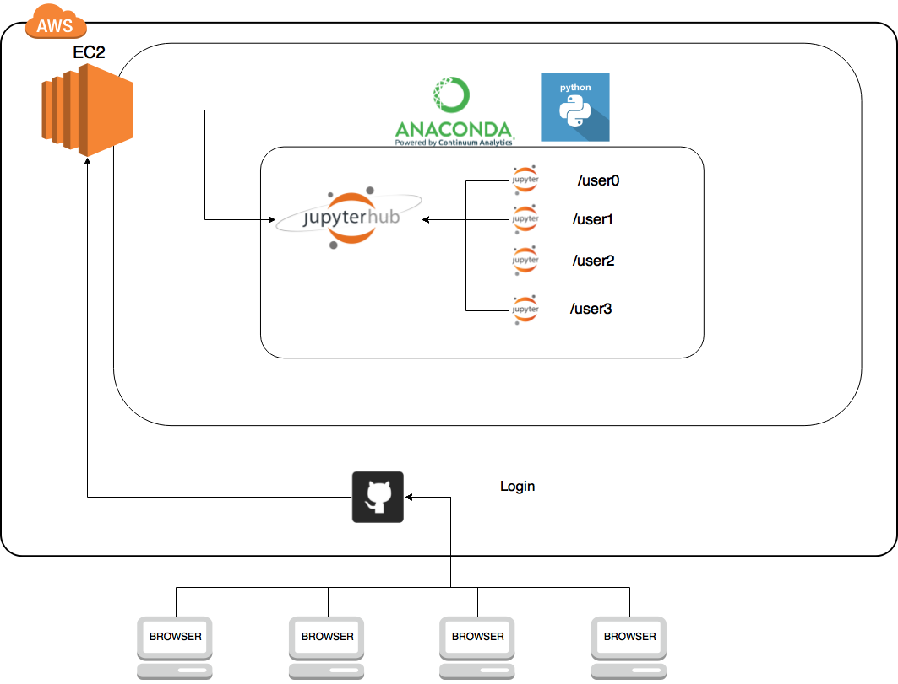
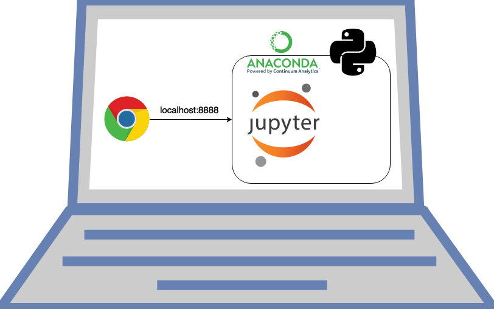

---

title: "Introduction to Jupyter Hub"
teaching: 15
exercises: 0
questions:
- "What is JupyterHub?"
objectives:
- learn about our overall computing framework for geohackweek
keypoints:

---

## JupyterHub

Here is a conceptual graphic of our cloud-based JupyterHub environment for geohackweek:

 
 
 

Here is a diagram of the typical implementation of Python on your local machine:

