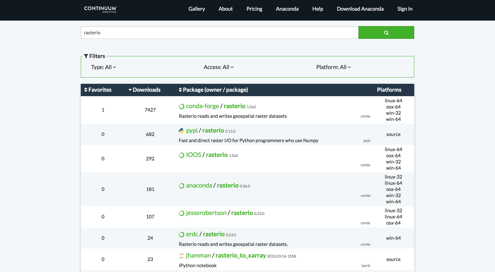
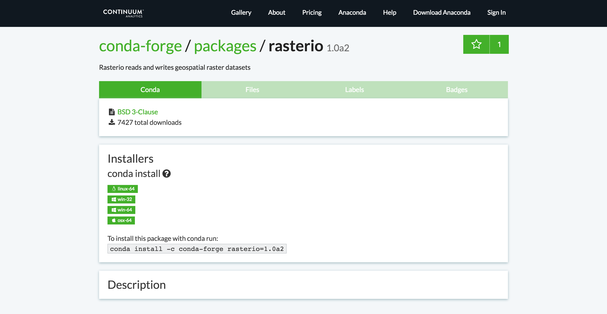

---

title: "Introduction to Conda"
teaching: 15
exercises: 0
questions:
- "What is Conda?"
- "How can I use conda in managing all the libraries for my projects"
objectives:
- explore how most people currently install and manage python libraries
- discuss how current methods causes headaches in managing the vast libraries for various projects
keypoints:
- conda can be installed in two ways (Anaconda and Miniconda)
- conda package manager works across systems
- projects can be separated by individual environments
- this tool will save headaches when trying to install packages with dependancies or managing multiple libraries/projects

---

## 0. Review from Preliminary

#### What is Conda?

[**conda**](http://conda.pydata.org/docs/) is an **open source `package` and `environment` management system for any programming language**;
though it is quite popular in the python community.

#### What is Anaconda?
[Anaconda](https://www.continuum.io/why-anaconda) is a distribution of conda. It is a data science platform that comes with a lot of packages.

#### What is Miniconda?
Unlike Anaconda, Miniconda doesn't come with any installed packages by default.
Note that for miniconda, everytime you open up a terminal, `conda` won't automatically be available. Run the command below to use conda within miniconda.

~~~
$ export PATH=$HOME/miniconda/bin:$PATH
~~~
{: .bash}

> ## What I'm using for this tutorial?
>
> For this tutorial, I am using Anaconda. If you have miniconda, the commands will be the same! *This also applies across operating systems (Except for the activation of environment)*.
>
{: .callout}

**Use the terminal window to access Conda in Linux or OS X and Anaconda prompt in Windows.**

---
## 1. Managing Conda

Let's first start by checking if conda is installed.

~~~
$ conda --version
~~~
{: .bash}

~~~
conda 4.2.13
~~~
{: .output}

> ## Conda Help and Manual
>
> To see the full documentation for any command, type the command followed by `--help`. For example, to learn about the conda update command:
>
> ~~~
> $ conda update --help
> ~~~
> {: .bash}
{: .callout}

Once it has been confirmed that conda has been installed, we will now make sure that it is up to date.

~~~
$ conda update conda
~~~
{: .bash}

~~~
Using Anaconda Cloud api site https://api.anaconda.org
Fetching package metadata: ....
.Solving package specifications: .........

Package plan for installation in environment //anaconda:

The following packages will be downloaded:

    package                    |            build
    ---------------------------|-----------------
    conda-env-2.6.0            |                0          601 B
    ruamel_yaml-0.11.14        |           py27_0         184 KB
    conda-4.2.12               |           py27_0         376 KB
    ------------------------------------------------------------
                                           Total:         560 KB

The following NEW packages will be INSTALLED:

    ruamel_yaml: 0.11.14-py27_0

The following packages will be UPDATED:

    conda:       4.0.7-py27_0 --> 4.2.12-py27_0
    conda-env:   2.4.5-py27_0 --> 2.6.0-0
    python:      2.7.11-0     --> 2.7.12-1
    sqlite:      3.9.2-0      --> 3.13.0-0

Proceed ([y]/n)? y

Fetching packages ...
conda-env-2.6. 100% |################################| Time: 0:00:00 360.78 kB/s
ruamel_yaml-0. 100% |################################| Time: 0:00:00   5.53 MB/s
conda-4.2.12-p 100% |################################| Time: 0:00:00   5.84 MB/s
Extracting packages ...
[      COMPLETE      ]|###################################################| 100%
Unlinking packages ...
[      COMPLETE      ]|###################################################| 100%
Linking packages ...
[      COMPLETE      ]|###################################################| 100%

~~~
{: .output}

Conda will compare versions and let you know what is available to install.
It will also tell you about other packages that will be automatically updated or changed with the update.
*If there are newer version available, follow the instruction to install the newest version of conda.*

In my case, the conda needed to be updated, along with this update, some dependencies also need to be updated.
There is also a NEW package that will be INSTALLED in order to update conda.

---
## 2. Managing Environments

### What is a conda environment and why is it so useful?

Using `conda`, you can create an isolated python *environment* for your project.
An environment is a set of packages that can be used in one or multiple projects.
The default environment with Anaconda is the root environment, which contains Anaconda default packages listed [here](https://docs.continuum.io/anaconda/pkg-docs).

There are two ways of creating a conda environment.

1. An environment file in YAML format (`environment.yml`).
2. Manual specifications of packages.

---
#### Creating environment with an environment file.

YAML? What's that?

- YAML stands for YAML Ain't Markup Language
- It is a human friendly data serialization standard for all programming languages.

> ## An example of environment file (`environment.yml`)
>
> This is an example of an environment file that will install `python 3.6`, `python-pip`, and `pyjokes` library using pip.
> Conda is friendly with pip, so if some packages are not found in Anaconda Cloud, then
> you can install them with `pip install`. Open up your favorite text editor, copy and paste the code below,
> save your file as `environment.yml`.
>
> ~~~
> name: playenv
> channels:
> - conda-forge
> dependencies:
> - python=3.6
> - pip
> - pip:
>     - pyjokes
> ~~~
> {: .source}
{: .callout}

Now, let's install `environment.yml` environment file above so that we can create a conda environment called `playenv`.

~~~
$ conda env create --file environment.yml
~~~
{: .bash}

~~~
Using Anaconda Cloud api site https://api.anaconda.org
Fetching package metadata .........
Solving package specifications: ..........
Linking packages ...
[      COMPLETE      ]|###################################################################################################################################################################| 100%
Collecting pyjokes
  Downloading pyjokes-0.5.0-py2.py3-none-any.whl
Installing collected packages: pyjokes
Successfully installed pyjokes-0.5.0
#
# To activate this environment, use:
# > source activate playenv
#
# To deactivate this environment, use:
# > source deactivate playenv
#

~~~
{: .output}

From the output above, the instruction highlighted ways to activate and deactivate environment.
**Note: This command is slighty different between operating systems.**

Use an environment:

- Linux, OS X: `$ source activate bunnies`
- Windows: `$ activate bunnies`

Deactivate an environment (goes back to root):

- Linux, OS X: `$ source deactivate`
- Windows: `$ deactivate`

---
#### Creating environment by manually specifying packages.

We can create `test_env` conda environment by specifying the name, channel, and list of packages within the terminal window.
In the example below, I am creating the `test_env` environment that uses python 2.7 and a list of libraries: `numpy`, `matplotlib`, `pandas`.

~~~
$ conda create -c conda-forge -n test_env python=2.7 numpy matplotlib pandas
~~~
{: .bash}

Conda will solve any dependencies between the packages like before and create a new environment with those packages.

> ## Verifying current environment
>
> To know the current environment that you're in you can either look at your terminal:
>
> ~~~
> (test_env) D-69-91-135-15:env_files lsetiawan$
> ~~~
> {: .bash}
>
> The `(test_env)` in the beginning of the line indicates that I'm curently using the `test_env` conda environment.
>
> Another way that you can check for your current active environment is a command:
>
> ~~~
> $ conda env list
> ~~~
> {: .bash}
> ~~~
> test_env              *  //anaconda/envs/test_env
> playenv                  //anaconda/envs/playenv
> root                     //anaconda
> ~~~
>{: .output}
>
> The current environment is indicated by (\*) character.
> This is also a great way to see the list of environments that have been created.
> In the list, the path to each environment is also shown.
>
{: .callout}

---
### Sharing Environments with others

To share an environment, you can export your conda environment to an environment file.
By doing this, the resulting environment file is very detailed with specific version listing.

Exporting your environment to a file called `myenv.yml`:

~~~
$ conda env export -f test_env.yml -n test_env
~~~
{: .bash}

This will export a very detailed environment file that you can share with other.
This file specifies the `package=version=build`.
This environment file will not work to share across platform, since the builds and versions might be different.

> ## Best practice to share environments
>
> 1. Always start from an environment file.
> 2. As you add packages to the environment, be sure to update the file.
> 3. Try not to hardwire versions so you will always have the most up to date version and works across platform, *unless you have to*.
>
> If you follow these guidelines, you should be able to give your environment file to anyone,
> and they will be able to install your packages with no problem.
{: .callout}

---
### Making an exact copy of an environment and deleting environment

#### Copying an environment

We can make an exact copy of an environment to an environment with a different name.
This maybe useful for any testing vs live environments or python 2.7 vs python 3.6 for the same packages.
In this example, `test_env` is cloned to create `live_env`.

~~~
$ conda create --name live_env --clone test_env
~~~
{: .bash}

#### Deleting an environment

Deleting an environment is very easy using conda.
Since we are only testing out our environment, we will delete `live_env` to de-clutter ourselves. *Make sure that you are not currently using `live_env`.*

~~~
$ conda env remove -n live_env
~~~
{: .bash}

---
## 3. Managing Packages

#### Seeing what packages are available

We will now check packages that are available to us.
The command below will list all the packages in an environment, in this case `test_env`.
The list will include versions of each package, the specific build,
and the channel that the package was downloaded from.
`conda list` is also useful to ensure that you have installed the packages that you desire.

~~~
$ conda list -n test_env
~~~
{: .bash}

~~~
# packages in environment at //anaconda/envs/test_env:
#
Using Anaconda Cloud api site https://api.anaconda.org
blas                      1.1                    openblas    conda-forge
ca-certificates           2016.9.26                     0    conda-forge
certifi                   2016.9.26                py27_0    conda-forge
cycler                    0.10.0                   py27_0    conda-forge
freetype                  2.6.3                         1    conda-forge
functools32               3.2.3.2                  py27_1    conda-forge
libgfortran               3.0.0                         0    conda-forge
...

~~~
{: .output}

#### Searching for a certain package

Some packages might not be available in conda, but it is available in [pypi](https://pypi.python.org/pypi). For example, we will search for rasterio within the [anaconda cloud](https://anaconda.org/).
*It is not necessary to create an account with anaconda cloud, unless you'd like to contribute in the future when you are pro with conda.*

> ## Anaconda Cloud and Trusted Sources
>
> **Anaconda Cloud** is a package management service that makes it easy to find, access, store and share public and private notebooks,
> environments, and conda and PyPI packages,
> and to keep up with updates made to the packages and environments you're using (Ref. [Anaconda Cloud Doc](https://docs.continuum.io/anaconda-cloud/)).
> Anaconda Cloud is made up of channels/owners. Each channels contains one or more conda packages. 
>
> It is important to be careful when downloading any packages from an untrusted source. [Conda forge](https://conda-forge.github.io/) is a reliable source for many popular python packages. It is wise to research about the source of a conda package.
>
{: .callout}

In this example, we will use rasterio from conda-forge. The anaconda cloud page for rasterio will show how to install the package, compatible OS, individual files for that package, etc.

If you are using anaconda, you can do this search within the command line:

~~~
$ anaconda search rasterio
~~~
{: .bash}

~~~
Using Anaconda Cloud api site https://api.anaconda.org
Run 'anaconda show <USER/PACKAGE>' to get more details:
Packages:
     Name                      |  Version | Package Types   | Platforms      
     ------------------------- |   ------ | --------------- | ---------------
     IOOS/rasterio             |    1.0a2 | conda           | linux-64, win-32, win-64, osx-64
     Terradue/rasterio         |   0.32.0 | conda           | linux-64       
                                          : Fast and direct raster I/O for use with Numpy and SciPy
     anaconda/rasterio         |   0.36.0 | conda           | linux-64, win-32, win-64, linux-32, osx-64
     conda-forge/rasterio      |    1.0a2 | conda           | linux-64, win-32, win-64, osx-64
                                          : Rasterio reads and writes geospatial raster datasets
     dharhas/rasterio          |   0.23.0 | conda           | win-64         
                                          : Rasterio reads and writes geospatial raster datasets.
     erdc/rasterio             |   0.23.0 | conda           | win-64         
                                          : Rasterio reads and writes geospatial raster datasets.
     jesserobertson/rasterio   |   0.23.0 | conda           | linux-64, linux-32, osx-64
     jhamman/rasterio_to_xarray | 2016.03.16-1558 | ipynb           |                
                                          : IPython notebook
     krisvanneste/rasterio     |   0.26.0 | conda           | win-64         
     ocefpaf/rasterio          |   0.19.1 | conda           | linux-64, osx-64
     omgarcia/rasterio         |   0.25.0 | conda           | linux-64       
     pypi/rasterio             |   0.13.2 | pypi            |                
                                          : Fast and direct raster I/O for Python programmers who use Numpy
     robintw/rasterio          |   0.35.1 | conda           | osx-64         
                                          : Rasterio reads and writes geospatial raster datasets
     sgillies/rasterio         |     0.15 | conda           | osx-64         
     ztessler/rasterio         |   0.31.0 | conda           | osx-64         
                                          : Fast and direct raster I/O for use with Numpy and SciPy
Found 15 packages
~~~
{: .output}

#### Installing conda package

Under the name column of the result in the terminal or the package column in the Anaconda Cloud listing, shows the necessary information to install the package. Ex. conda-forge/rasterio. The first word list the channel that this package is from and the second part shows the name of the package.

To install the latest version available within the channel, do not specify in the install command. We will install version 0.35 of `rasterio` from conda-forge into `test_env` in this example. Conda will also automatically install the dependencies for this package.

~~~
$ conda install -c conda-forge rasterio=0.35
~~~
{: .bash}

> ## Pre-configuring Channels
>
> If you have a few trusted channels that you prefer to use, you can pre-configure these so that everytime you are creating an environment, you won't need to explicitly declare the channel. 
>
> ~~~
> $ conda config --add channels conda-forge
> ~~~
> {: .bash}
{: .callout}

#### Removing Conda Package

We decided that rasterio is not needed in this tutorial, so we will remove it from `test_env`. Note that this will only remove the main package rasterio, not its dependencies.

~~~
$ conda remove -n test_env rasterio
~~~
{: .bash}

~~~
Using Anaconda Cloud api site https://api.anaconda.org
Fetching package metadata .........
Solving package specifications: ..........

Package plan for package removal in environment //anaconda/envs/test_env:

The following packages will be REMOVED:

    rasterio: 0.35.1-np111py27_1 conda-forge

Proceed ([y]/n)? y

Unlinking packages ...
[      COMPLETE      ]|#######################################################################################################| 100%
~~~
{: .output}

For lots more feature of conda, check out the documentation [here](http://conda.pydata.org/docs/index.html)

## RECAP

### Why should we use conda?

- It has a way to solve version dependencies
- Reproducible environments can be created easily
- Most conda packages are friendly across all platforms

If you're not convinced of using conda, read this great blog [here](http://technicaldiscovery.blogspot.com.br/2013/12/why-i-promote-conda.html)
