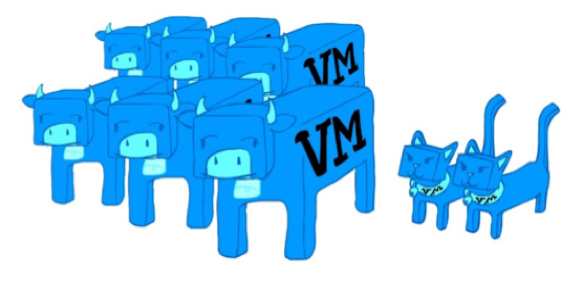

---

title: "Cloud Computing in Geospatial Sciences"
teaching: 15
exercises: 0
questions:
- "How can cloud computing help "
objectives:
- learn about our overall computing framework for geohackweek
keypoints:

---

## Cloud computing fundamentals
### Benefits of cloud computing 
- On-demand, shared and configurable pool of resources
- Rapidly provisioned
- Highly scalable
- Cattle not pets

### Types of cloud computing services

*** Terminology/definitions becoming less relevant ***

- Infrastructure as a service (IaaS)
  - E.g. virtual machines with operating systems, like traditional servers
  
- Platform as a service (PaaS)
  - No need to maintain hardware or operating systems
  - E.g. Google App Engine, web applications
  
- Software as a service (SaaS)
  - E.g. ArcGIS on the cloud, Google Docs, email 

- Data as a service
  - Collected data is shared in human readable form 

**Definitions are becoming less relevant**

## Important things to think about 
- How do I choose a cloud provider? (e.g. AWS, Azure, Google Cloud Platform)
- Costing
- Pervasiveness of vendor in field
- Continuous, integrated delivery (build-test-share)
  - Use Github for collaboration and coordination

## Examples of Applications on the Cloud with a Geospatial focus
- Web frameworks with API (AralDIF/NicaDIF/HiMAT)
  - Elastic Beanstalk. Django (Python) for webframework
  - API building
- Geoserver for data sharing
  - Open-source geospatial server written in Java that allows users to share, process and edit geospatial data
  - Leaflet frontend
- Jupyterhub
