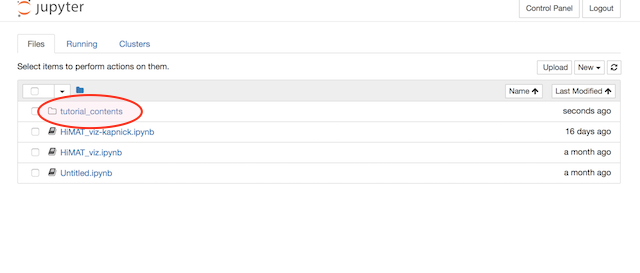
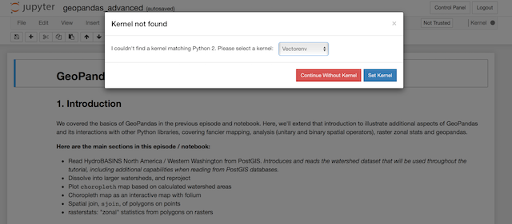

---

title: "Introduction to JupyterHub"
teaching: 15
exercises: 0
questions:
- "What is JupyterHub?"
objectives:
- learn about our overall computing framework for geohackweek
keypoints:

---

## JupyterHub Access
The JupyterHub for GeohackWeek is accessible at: https://jupyterhub.cloudmaven.org

You will need a [Github](http://www.github.com) account for authentication. 

## Jupyter Notebook

- A Jupyter Notebook App is a web application for running and sharing notebook documents. 
- A notebook document can contain code and other elements that are executable via a kernel. It can also contain rich text and figures.
- A kernel executes the code in a notebook document. A kernel can be an environment (e.g. a conda environment)
- A Jupyter Notebook can help encourage collaboration, and reduces the need to "reinvent the wheel"

## JupyterHub What Is
Here is an amazing slide deck about Jupyterhub: [JupyterHub Thing Explainer](https://www.slideshare.net/willingc/jupyterhub-a-thing-explainer-overview)

If you're lazy, here is one slide: 


## JupyterHub for GeohackWeek

This is a conceptual graphic of our cloud-based JupyterHub environment for geohackweek:


- AWS EC2 instance, Github authentication, multiple spawns 

## Initial Setup

### Paths and folders
Open a new Jupyter Notebook terminal. If you type `conda`, you will get a conda usage guide:

``` usage: conda [-h] [-V] command ... ```

If you get "conda: command not found", you will need to add the conda path to your bash profile by exporting the path:
``` export PATH=/opt/anaconda/bin:$PATH ```

Next, we are going to clone the Git repository we will be using for the tutorials this week. You will need to clone this into the 'notebooks' folder in your home directory. 

``` 
$ ls # check your present working directory and list available files and folders
$ cd notebooks # change directory to notebooks
$ pwd # check present working directory again, it should say something like /home/user/notebooks
$ git clone 'https://github.com/geohackweek/tutorial_contents.git'
$ ls # check that the folder is there
```




### Notebooks and environments
1. Return to the Jupyterhub home tab
2. You should now see tutorial_contents as a folder
3. We will test out setting environments for our notebooks. 
   - Change directories to tutorial_contents > vector > notebooks 
   - Select geopandas_advanced.ipynb
   - You will be prompted to select a kernel. Select the Vectorenv kernel. 


   
